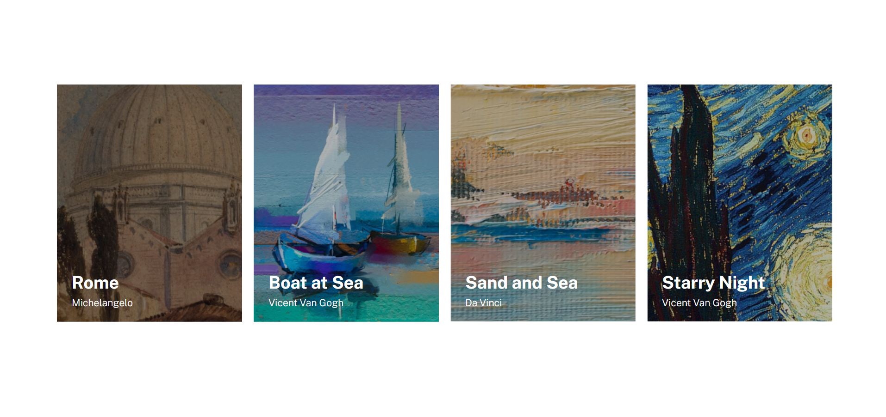

# Projeto Lista de Imagens

Projeto onde foi criado uma lista com algumas imagens e realizado o posicionamento correto dessas imagens. 🖼️

[    
    - Versão mobile
    
    - Versão desktop
    
    
]

## Tecnologias utilizadas
- HTML
- CSS

## O que eu aprendi?
Aprendi a tornar o projeto responsivo para que tanto usuário que acessem pelo celular quanto pelo computador possam visualizar as imagens pefeitamento, também aprendi a posicionar os elementos do projeto utilizando o flexbox.